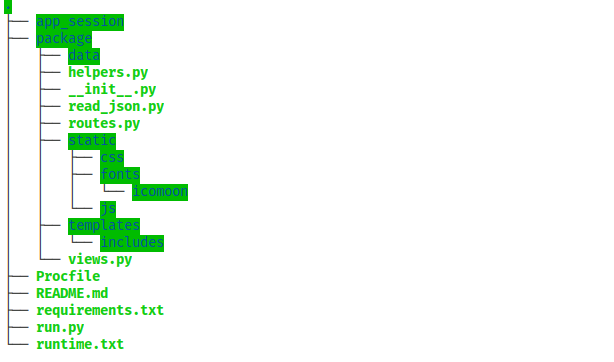

README TEMPLATE

# Quiz App
*A website that is used to conduct quiz*

## Installation
* First you have to get [Python](https://www.python.org/) installed on your computer.
* Create a new directory
* Open the directory in a terminal, then enter the command `git init .`
* Enter the command `git clone https://github.com/iSOLveIT/nursingcollege.git` in the terminal

* Install all dependencies in the requirements.txt file by using command `pip install -r requirements.txt`

## How to run the app
#### Using the Flask WSGI_server
* In order to run the app, open the directory in a terminal, then enter the command `python3 run.py` 

#### Using the Gunicorn_server
* To run the app, open the directory in a terminal, then enter the command `gunicorn -w 3 -b "localhost:5500" run:app`

* NOTE: 
    * If you intend using this project in the productive environment do not use the development server.
    * Make sure debug=True is cleared in a productive environment

## What does the app achieve?
* The app helps teachers in conducting exams online
* The app automatical marks the exams and shows results to students
* The app shows students only due exams

## How the app was designed to achieve that?
* The app was designed with the Python web framework called Flask. 
* The app was designed as a package to make the code maintainable.
* The app used the Django MVC architecture by having a different files for holding both the views (views.py) and routes (routes.py in Django known as url.py)
* The app was designed for testing purposes
* The app queries data from a json file

## Main Pages
* HOME ==> Welcome Page for website visitors and contains login form
* DASHBOARD ==> Page for students that shows all the courses offered by a student 
* COURSES ==> Shows students the due exams for a course
* EXAMINATION ==> Page with information about an exam. Also, it shows the number of attempts made a student and the marks they had
* EXAM ===> Page with questions to be answered and a timer fuction to monitor time

## Directory Structure

## Preview Link
[QuizApp](https://nursingcollege.herokuapp.com/dashboard/10087872)

## Author
* __Duodu Randy :octocat:__

### Date Created
* _Friday, 13th March, 2020_
